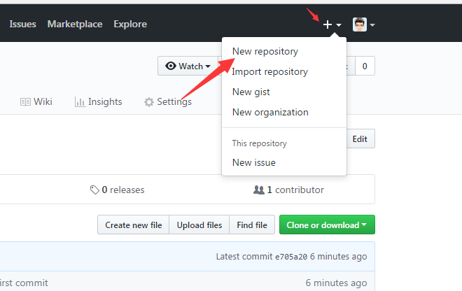
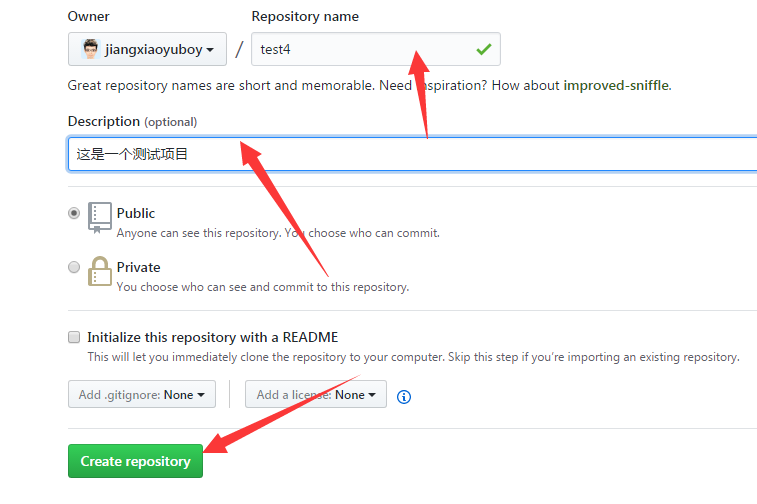
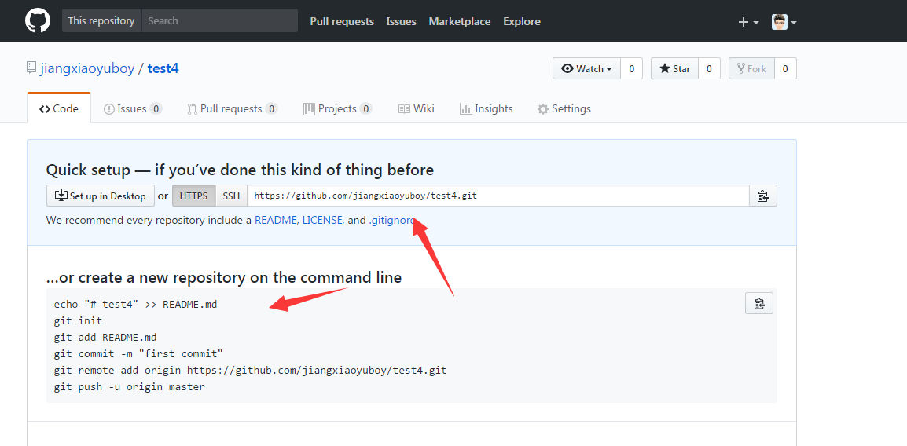

#github的注册以及可以自行百度
使用以下命令生成SSH Key

```
$ ssh-keygen -t rsa -C "youremail@example.com"
```
创建新项目的步骤如下

 
然后输入相关内容就可以了 如下图（test4）
 
然后创建一个文件test4,通过git工具 git bash进入这个文件执行如下图的命令即可（github上有提示）

 
至此，可以把要托管的项目放到test4文件夹下，然后进入文件路径下执行一系列git命令(git add --all/git commit -m "解释"/ git push -u origin master)