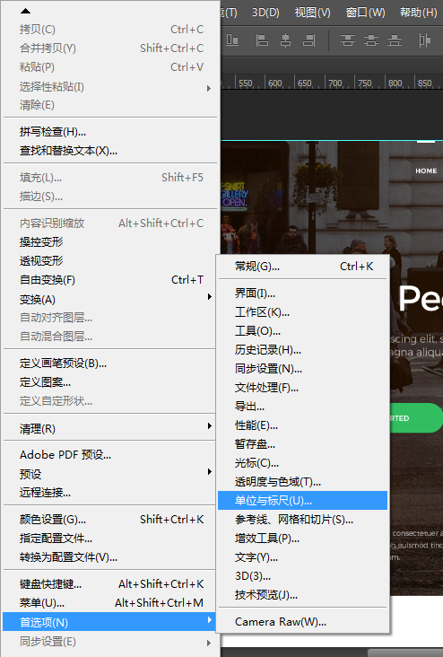
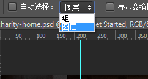
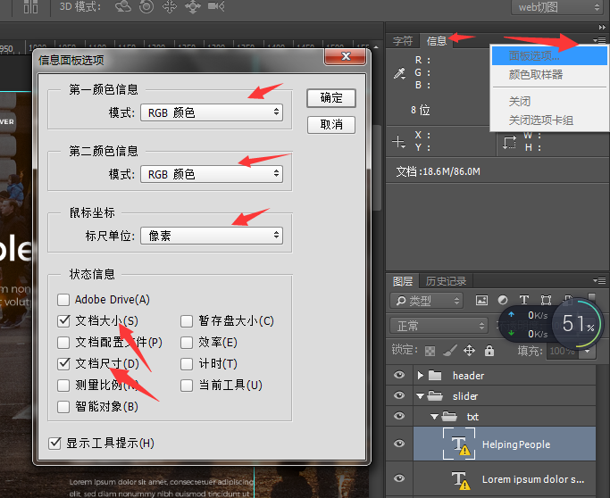
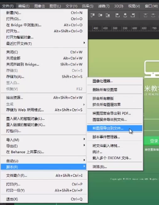
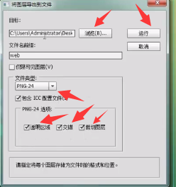

1、打开ps软件，点击“编辑”-“首选项”-“单位与标尺”的单位与标尺改成“像素”


2、选择改成‘图层’，“自动选择”建议不选，在psd选择要切的图片时，点击左栏的拖动图标，选中图片，按住ctrl键，鼠标左击


3、把“视图”里面的“标尺”和“视图”-“显示”-“智能参考线”和“参考线”勾上
4、 在“窗口”这栏 勾上“图层”，“信息”，“历史记录”，“字符”，其他的可以勾掉
5、在右测“信息”，点击“面板选项”，做如下图修改


6、设置完成后，在“窗口”-“工作区”-“新建工作区”命名一个工作区，以便下次打开的时候使用
``` bash
  精准切图（有的版本不支持）
```
1、点击“文件”-“脚本”-“将图层导出到文件”，并做如下图修改

