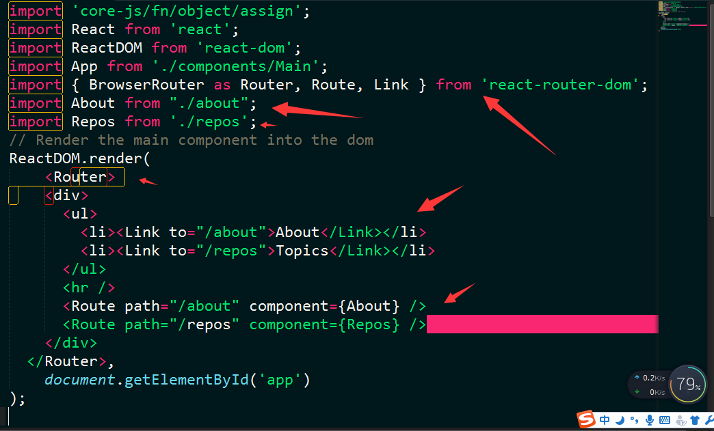
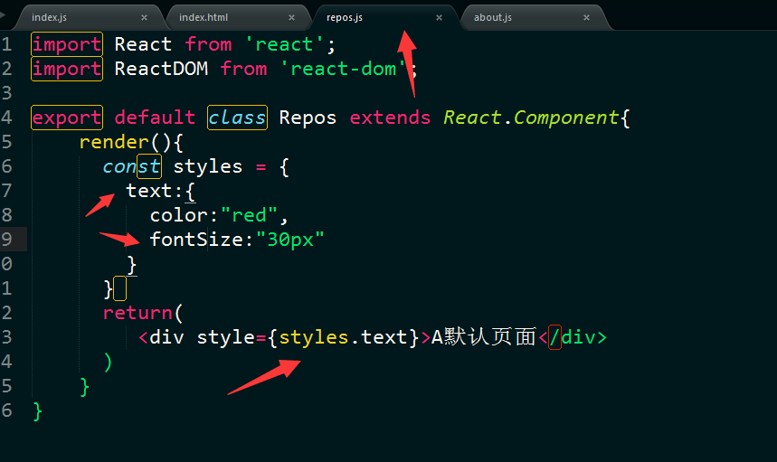
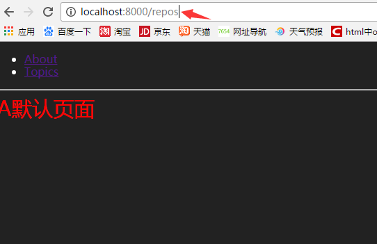

react的生态圈非常庞大，第三方的构建工具也有很多种，这节课介绍一个在业内比较流行的构建工具generator-react-webpack，它是需要yeoman的支持的。
安装还是在命令行用npm进行安装，不过在全局安装generator-react-webpack之前，你可以先安装yeoman。命令如下：
安装
``` bash
  npm install -g yo
  npm install -g generator-react-webpack
```
创建目录
我们先用命令自行创建一个文件：new-react-demo
``` bash
  mkdir new-react-demo
```
进入这个文件夹
``` bash	
  cd new-react-demo
```
用生成器生成我们的项目目录
``` bash	
  yo react-webpack
```
用npm start就可以查看效果了。
项目起来之后我们来配置路由
Router包安装:
安装包还是要打开命令行工具，使用npm来进行安装。
``` bash	
  npm install --save react-router react-router-dom
```
react-router：是基本的router包，里边函的内容较多，但是在网页开发中有很多用不到，现在的市面上的课程讲的基本都是这个包的教程。
react-router-dom：随着react生态环境的壮大，后出现的包，这个包比react-router包轻巧了很多。
剩下的就是代码了，直接上图 index.js的内容

接下来是路由到两个页面的页面内容

注意的点是样式的写法，比如'引入方式'，'驼峰命名',
当然样式的写法还有其他的写法，这里先不赘余。
效果
