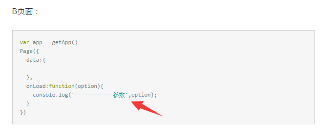
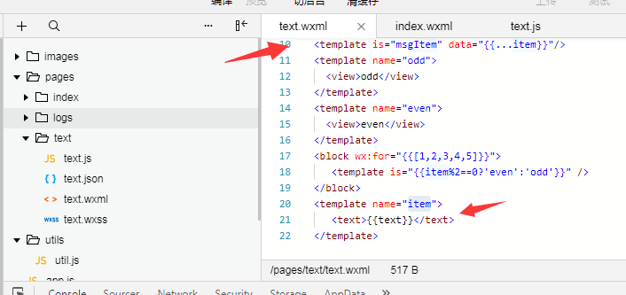
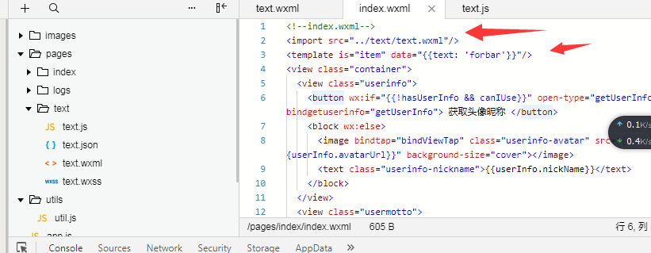

在分享小程序模板的引入方法之前，先来聊一下，小程序的跳转问题；小程序的跳转是 navigator负责。注意这个组件跳转的路径是“非tabBar”页面，并且要注意要跳转的页面在app.js的“ "pages"”配置上路径，另外，点击事件的路径跳转也是跳转的是“非tabBar”页面才会起作用。
url: 要跳转的路径，这里是可以传值的。参数与路径之间用？隔开，每个参数用&隔开，可以在要跳转的页面下查看参数

WXML提供模版(template),可以在模版中定义代码片段,然后在不同的地方调用.微信小程序的模版可以用name来命名它的名字,在使用的时候用is来声明使用的模版,然后将模版所需要的data传入即可,如下

在 index.wxml 中引用了 text.wxml，就可以使用text模板：
引入方法如下

