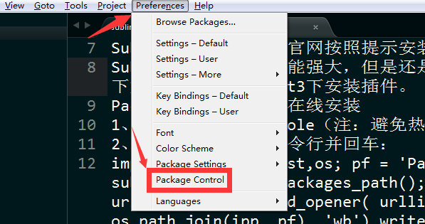
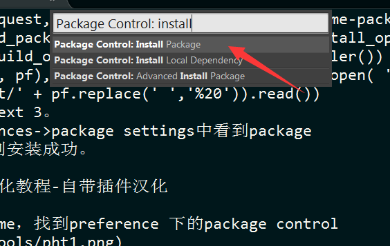
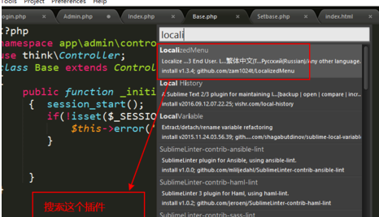
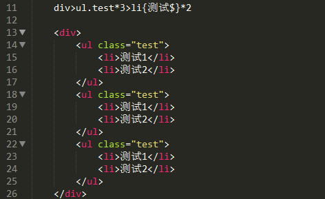
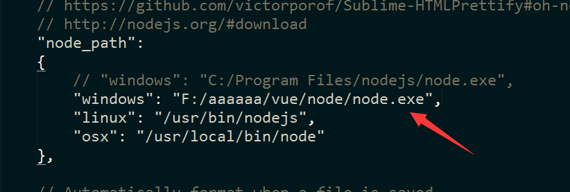

Sublime的安装可以去官网按照提示安装
Sublime Text3虽然功能强大，但是还是需要一些插件的辅助，下面我就给大家分享下如何在Sublime Text3下安装插件。
Package Control组件在线安装
1、按Ctrl+`调出console（注：避免热键冲突）
2、粘贴以下代码到命令行并回车：
import urllib.request,os; pf = 'Package Control.sublime-package'; ipp = sublime.installed_packages_path(); urllib.request.install_opener( urllib.request.build_opener( urllib.request.ProxyHandler()) ); open(os.path.join(ipp, pf), 'wb').write(urllib.request.urlopen( 'http://sublime.wbond.net/' + pf.replace(' ','%20')).read())
3、重启Sublime Text 3。
4、如果在Perferences->package settings中看到package control这一项，则安装成功。
``` bash
  sublimeText3汉化教程-自带插件汉化
```
1、首先打开sublime，找到preference 下的package control 


2、点击package control ，弹出如下框搜索install，找到install package点击进入



3、点击进入之后搜索localiza,找到如下选项，点击安装


``` bash
  Emmet（原名 Zen Coding）
```
一种快速编写html/css的方法
安装方法同汉化插件，在最后一步输入“Emmet”点击进入

输入快捷键 按Tab


``` bash
  HTML-CSS-JS Prettify
```
安装方法同上 
使用说明：快速格式化html css js
快捷键：ctrl+shift+h
注意：node.exe的路径以及版本



``` bash
 代码校验工具 SublimeLinter 的安装与使用
```
传送门：https://www.cnblogs.com/zhrn/p/5066309.html

``` bash
 Sublime Text 3 快捷键总结（拿走）
```
传送门：https://www.douban.com/note/362268947/