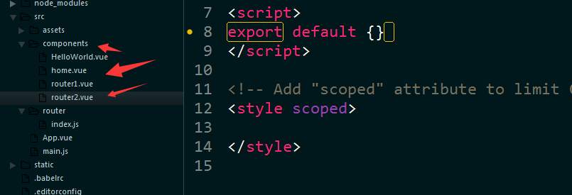
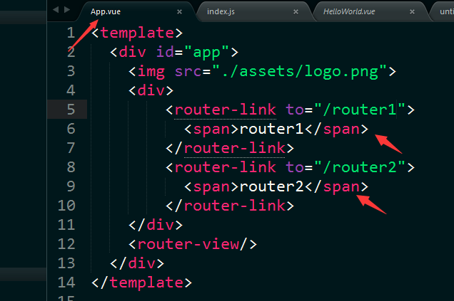
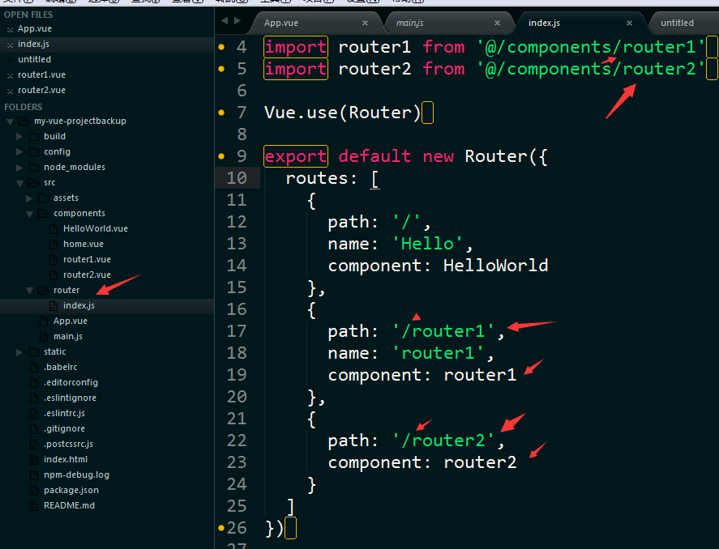
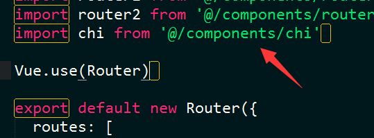
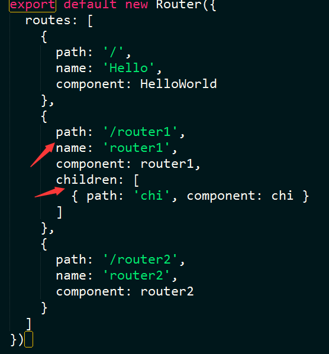
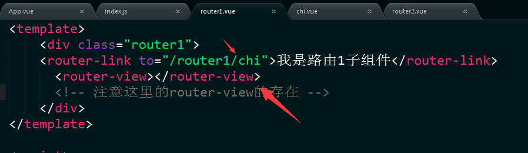

vue-router是Vue.js官方的路由插件，它和vue.js是深度集成的，适合用于构建单页面应用。vue的单页面应用是基于路由和组件的，路由用于设定访问路径，并将路径和组件映射起来。传统的页面应用，是用一些超链接来实现页面切换和跳转的。在vue-router单页面应用中，则是路径之间的切换，也就是组件的切换。

1、首先第一步，在components文件夹里新建两个.vue文件。将用它们来路由页面。并且分别取名router1.router2

2、接下来，我们要在app.vue里写好2个导航命名为router1和router2。分别用来将router2,router1路由进来。

3、在router文件夹下面的index.js做如下操作，注意路径的地方的"/"不要丢掉

4、子路由的使用方法(例子：router1的子路由)
4.1、在components文件夹下创建chi.vue
在router文件夹下面的index.js引入子路由页面

4.2、子路由的路径写法

4.3、子路由的父级的内容写法

