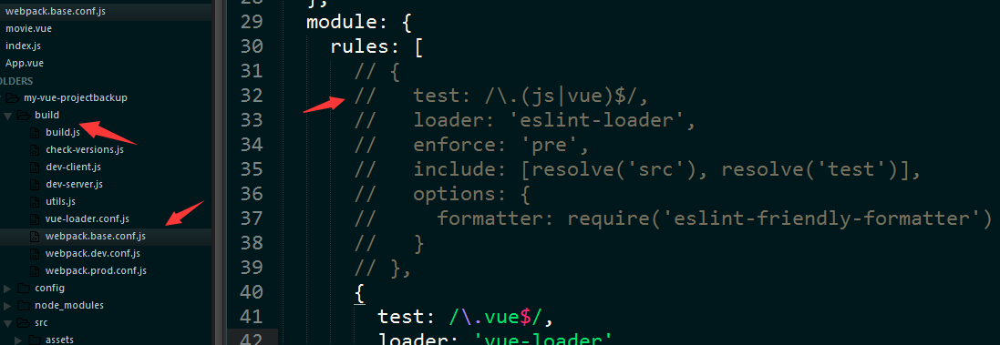
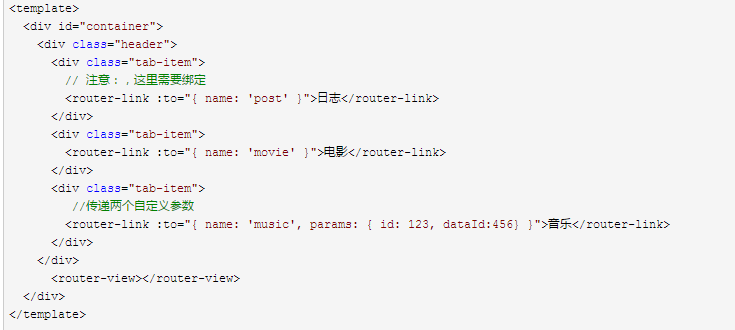
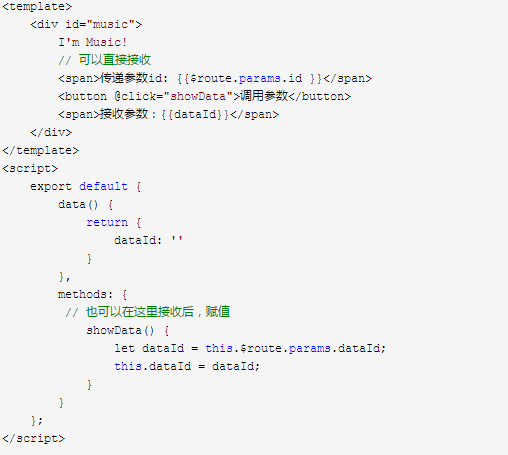
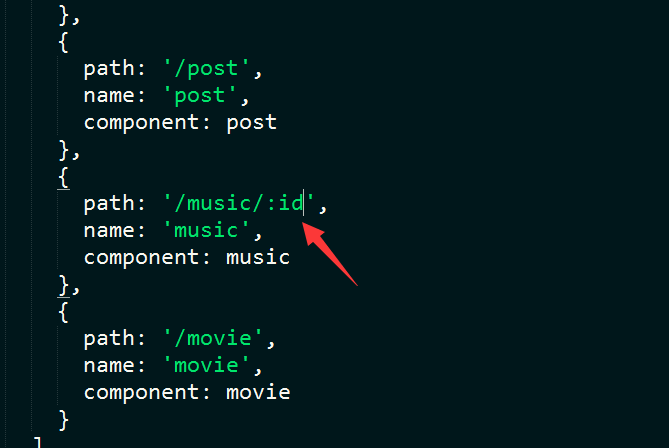
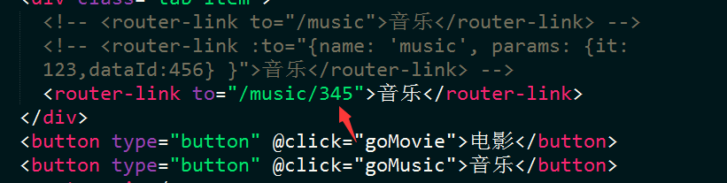
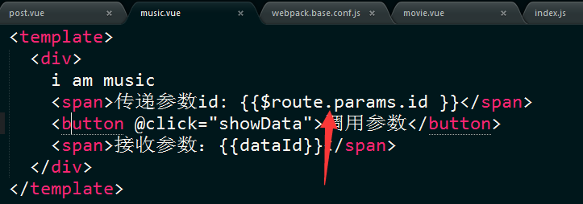

在写这篇文章之前，先来解决，取消vue在检测写法规则的方法
找到目录build下的webpack.base.conf.js文件，把其中的rules里的这一段注销掉：

 
 现在书归真转，路由的命名实际上就是给路由绑定一个name的属性，通过name的值来跳转；而参数的传递则可以在页面进行绑定，下面做一个最简单的例子
先把app.vue修改：

在修改接收参数的music.vue:

以上这种方法这样传递的参数就不会显示在url中。

下面来学习params方法传递的参数显示在url中
router文件夹下的index.js做如下修改

app.vue做如下修改

music.vue的写法

