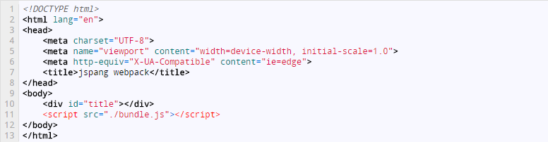
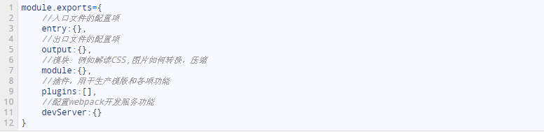
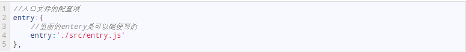
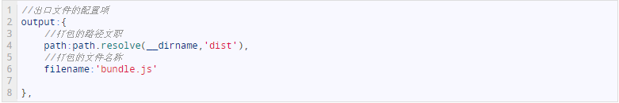
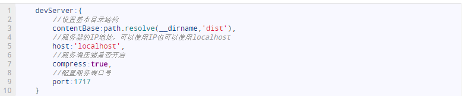
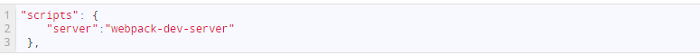
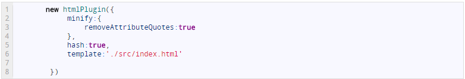

 已经有挺长时间没有开始写博客，最近工作需要用到react，要对webpack有所了解，下面就分享webpack的一些用法

 先建立项目文件，然后进入项目文件，执行相关命令
``` bash
  1、安装webpack，在命令行输入cnpm install --save-dev webpack
```
 这里的参数–save是要保存到package.json中，dev是在开发时使用这个包，而生产环境中不使用。
``` bash
  在命令行输入 cnpm init
```
输入完成后，npm终端会问你关于项目的名称，描述……一堆内容，如果你不考虑发布到npm上，这些内容都不重要，而且我们后期还可以用文本的形式修改这些内容。现在我们只要一路回车就完成了初始化。这时用dir命令已经可以看到生成的package.json文件了。

``` bash
 建立项目结构
```
进入我们建立的文件，建立两个根文件src，dist
  src文件夹：用来存放我们编写的javascript代码，可以简单的理解为用JavaScript编写的模块。
  dist文件夹：用来存放供浏览器读取的文件，这个是webpack打包成的文件。

你可以理解成src是源码文件，dist是我们编译打包好的文件；一个用于开发环境，一个用于生产环境。
``` bash
 编写程序文件
```
文件夹建立好后，我们在dist文件下手动建立一个index.html文件，并写入下面的代码。


这里引入了一个JavaScript的bundle.js文件。这个文件现在还没有，这是用webpack执行打包命令后生产的文件。我们的index.html写好后，接下来在src文件夹下建立entery.js的文件，用于编写我们的JavaScript代码，也是我们的入口文件。
``` bash
 配置文件：入口和出口
```
配置文件webpack.config.js
webpack.config.js就是Webpack的配置文件，这个文件需要自己在项目根目录下手动建立。建立好后我们对其进行配置，先看下面的代码（webpack.config.js的基本结构），这是一个没有内容的标准webpack配置模版。
#webpack.config.js


#entry选项（入口配置）
这个选项就是配置我们要压缩的文件一般是JavaScript文件（当然也可以是CSS…..）
#wepback.config.js中的entry选项


#output选项（出口配置）
出口配置是用来告诉webpack最后打包文件的地址和文件名称的。

如果你只这样写，是会报错的：找不到path这个东西。所以我们要在webpack.config.js的头部引入path，代码如下：
const path = require('path');
这个代码写完后，可以在终端中直接输入webpack就会进行打包。
``` bash
 配置文件： 服务和热更新
```
设置webpack-dev-server
要执行webpack-dev-server是要先用npm install webpack-dev-server –save-dev 来进行下载的。下载好后，需要配置一下devServer。最简单的devServer配置项只有四个。先看一下代码，然后我再作解释
/webpack.config.js



然后在package.json里配置一下scripts
/package.json

配置好保存后，在终端里输入 npm  run  server  打开服务器。然后在浏览器地址栏输入http://localhost:1717就可以看到结果了
``` bash
 插件配置：HTML文件的发布
```
有经验的小伙伴其实一眼就可以看出，现在我们的项目结构是有问题的，我们把index.html直接放到了dist文件夹下，这肯定是不正确的，应该放到我们src目录下。但是前期我们为了循序渐进的学习，所以把index.html放到了dist目录下。下面我们就学习如何把html文件打包到我们的生产路径下。

我们先把dist中的html文件剪切到src目录中，并去掉我们的JS引入代码（webpack会自动为我们引入JS），因为这才是我们真实工作的目录文件结构。

然后我们配置webpack.config.js文件，先引入我们的html-webpack-plugin插件。
``` bash
 const htmlPlugin= require('html-webpack-plugin');
```
引入后使用npm进行安装包。

``` bash
 npm install --save-dev html-webpack-plugin
```
最后在webpack.config.js里的plugins里进行插件配置，配置代码如下。


minify：是对html文件进行压缩，removeAttrubuteQuotes是却掉属性的双引号。
hash：为了开发中js有缓存效果，所以加入hash，这样可以有效避免缓存JS。
template：是要打包的html模版路径和文件名称。
上边的都配置完成后，我们就可以在终端中使用webpack，进行打包。你会看到index.html文件已经被打包到我们的dist目录下了，并且自动为我们引入了路口的JS文件。